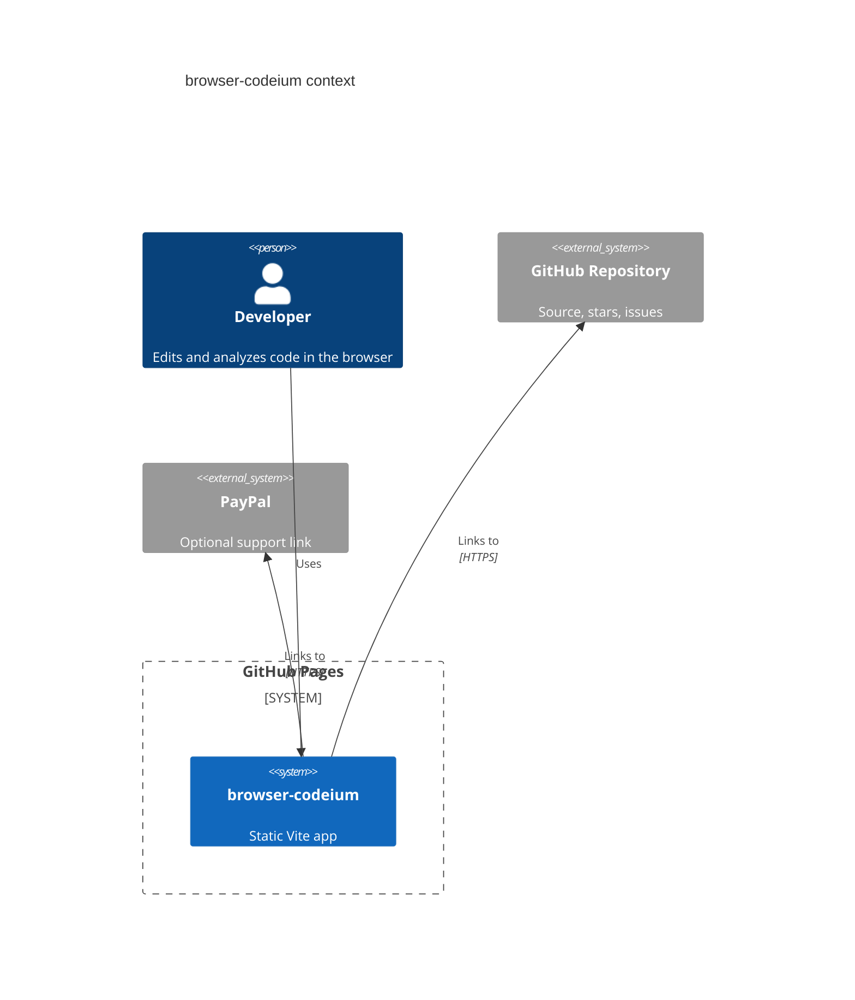

# browser-codeium


Live site: https://baditaflorin.github.io/browser-codeium/

Repository: https://github.com/baditaflorin/browser-codeium

Support: https://www.paypal.com/paypalme/florinbadita

browser-codeium is a static, local-first coding workspace that brings Monaco editing, tree-sitter WASM structure, WebGPU capability checks, and a deterministic assistant draft panel to GitHub Pages.


## Quickstart

```sh
npm install
make install-hooks
make dev
```

## What Ships

- Monaco editor with local sample workspace and File System Access folder import where the browser supports it.
- Tree-sitter analysis for JavaScript, TypeScript, TSX, and JSX using WASM grammar assets.
- IndexedDB workspace persistence, PWA shell, no analytics, no runtime backend, no app-owned secrets.
- Visible version and build commit on the live page.
- Public GitHub and PayPal links in the app header so visitors can star or support the project.

## Local Commands

```sh
make build
make test
make smoke
make lint
make pages-preview
```

## Architecture



Architecture docs: https://github.com/baditaflorin/browser-codeium/tree/main/docs

ADRs: https://github.com/baditaflorin/browser-codeium/tree/main/docs/adr

Deployment guide: https://github.com/baditaflorin/browser-codeium/blob/main/docs/deploy.md

Phase 2 substance postmortem: https://github.com/baditaflorin/browser-codeium/blob/main/docs/postmortem-phase2-substance.md
