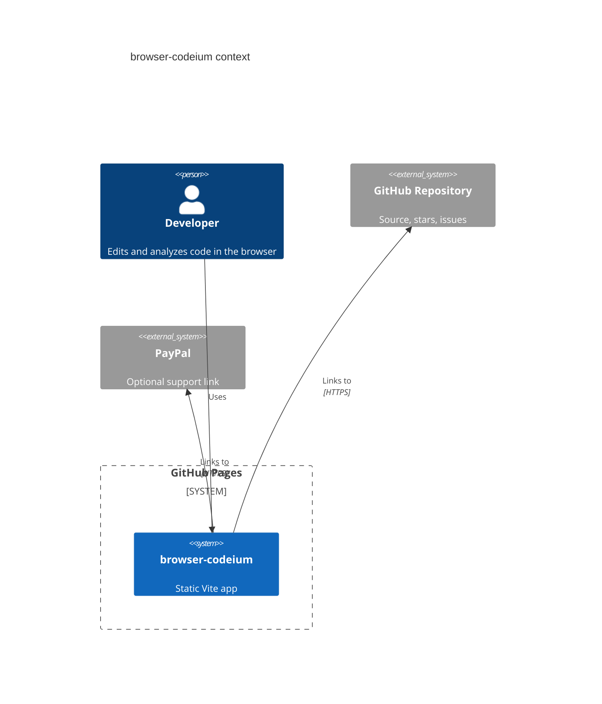

# browser-codeium


Live site: https://baditaflorin.github.io/browser-codeium/

Repository: https://github.com/baditaflorin/browser-codeium

Support: https://www.paypal.com/paypalme/florinbadita

browser-codeium is a static, local-first coding workspace that brings Monaco editing, tree-sitter WASM structure, WebGPU capability checks, and a deterministic assistant draft panel to GitHub Pages.


## Quickstart

```sh
npm install
make install-hooks
make dev
```

## What Ships

- Monaco editor with sample loading, multi-file upload, drag/drop import, pasted-file import, clipboard import, and Chromium folder import where the browser supports it.
- Tree-sitter analysis for JavaScript, TypeScript, TSX, and JSX using WASM grammar assets.
- Workspace state export/import, active-file copy/download, assistant-draft copy, and small-workspace share links.
- IndexedDB plus localStorage persistence for workspace behavior, a PWA shell, no analytics, no runtime backend, and no app-owned secrets.
- Visible version and build commit on the live page.
- Public GitHub and PayPal links in the app header so visitors can star or support the project.

## Verified Feature Checklist

- Import your own files without Chromium-only APIs.
- Restore the last workspace on reload.
- Save a versioned workspace snapshot and import it later.
- Copy or download the current file.
- Copy the deterministic assistant draft.
- Share a small workspace through a URL hash.
- Persist settings such as word wrap, font size, auto-analysis, and session restore.

## Limitations

- Tree-sitter analysis is intentionally limited to JavaScript, TypeScript, JSX, and TSX.
- URL import is not built in v0.3.0; remote fetch would need a more honest CORS story than a static app can promise.
- Share links are for small workspaces only and enforce a payload cap.
- Print/PDF export and automation-ready API exports are out of scope in this release.

## Local Commands

```sh
make build
make test
make smoke
make lint
make pages-preview
```

## Architecture



Architecture docs: https://github.com/baditaflorin/browser-codeium/tree/main/docs

ADRs: https://github.com/baditaflorin/browser-codeium/tree/main/docs/adr

Deployment guide: https://github.com/baditaflorin/browser-codeium/blob/main/docs/deploy.md

Phase 2 substance postmortem: https://github.com/baditaflorin/browser-codeium/blob/main/docs/postmortem-phase2-substance.md

Phase 3 completeness audit: https://github.com/baditaflorin/browser-codeium/tree/main/docs/phase3

Phase 3 postmortem: https://github.com/baditaflorin/browser-codeium/blob/main/docs/postmortem-phase3.md
