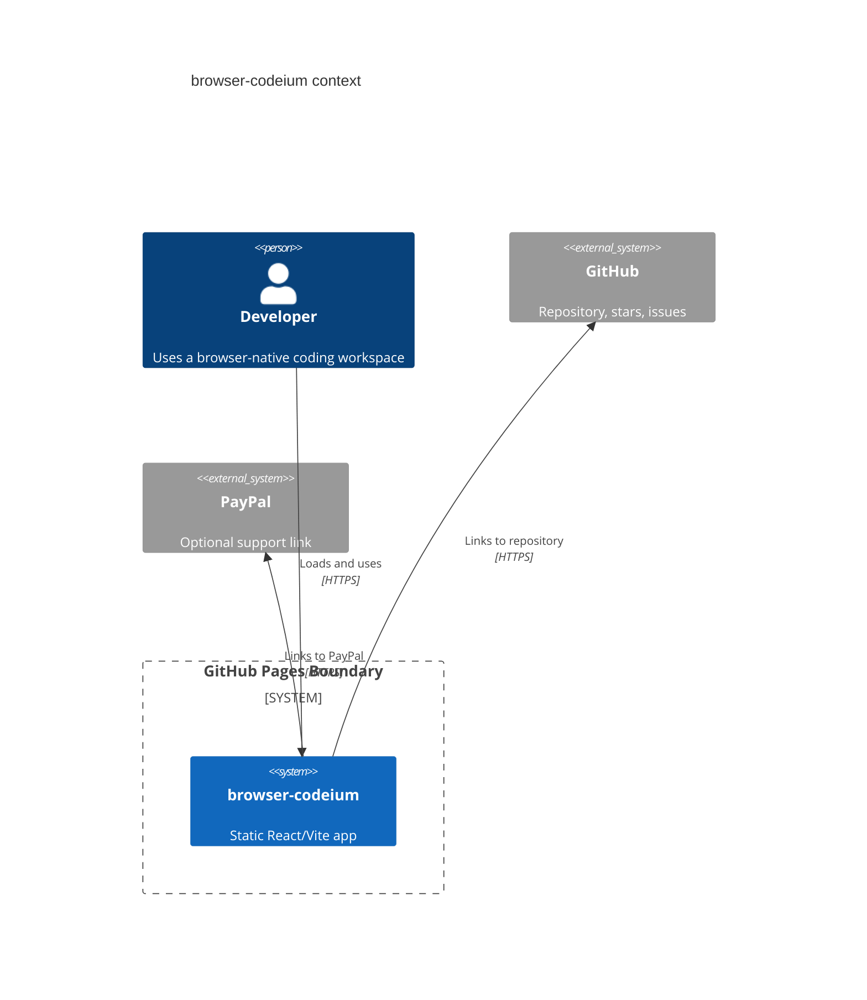
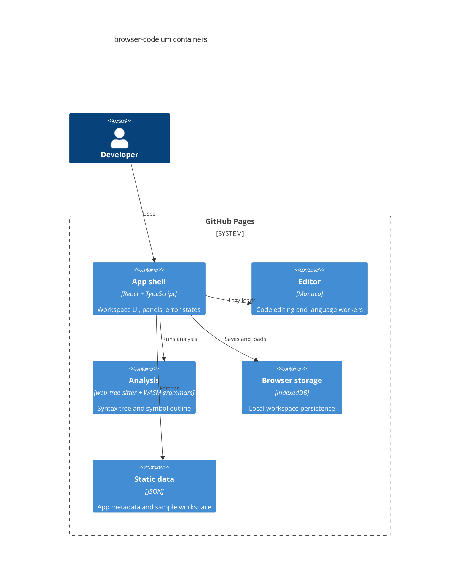

# Architecture

browser-codeium is Mode A: Pure GitHub Pages. The runtime is a static Vite application served from the `main` branch `docs/` directory.

Live URL: https://baditaflorin.github.io/browser-codeium/

Repository: https://github.com/baditaflorin/browser-codeium

## Context

## Containers

## Module Boundaries

- `src/features/workspace/` owns local files, samples, folder import, and IndexedDB persistence.
- `src/features/editor/` owns Monaco integration and workers.
- `src/features/analysis/` owns tree-sitter loading and fallback analysis.
- `src/features/assistant/` owns deterministic local assistant drafts.
- `src/features/system/` owns WebGPU checks and runtime diagnostics.
- `src/components/` owns shared UI surfaces.

## Pages Boundary

GitHub Pages serves static files only. There is no runtime server, no runtime database, no nginx layer, and no Docker image in v1. Service worker scope is `/browser-codeium/`.
